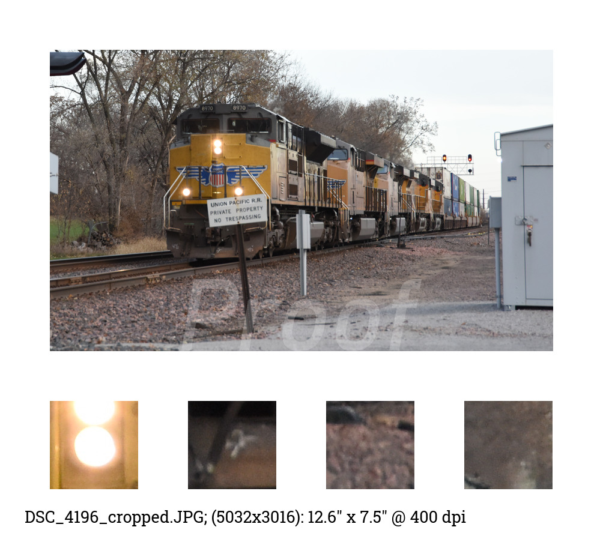

# proofs
python proof generator

example input:

generated proof:

## Setup
- make sure you have a recent version of python (I wrote this using 3.10)
- clone/download the repository
- `pip install wand`
- install [ImageMagick](https://imagemagick.org/script/download.php) (I used ImageMagick 7.1.1-21 Q16-HDRI)
- delete the test files that I left in `./source/` and `./dest/`

## Usage
- place image files in `./source/`
- run main.py
- proofs will be in `./dest/`

## Configuration
replace watermark.png with your own

### constants in main.py
- output size (maximum length in px of longer side)
- margins (width in px)
- minimum sample size (width in px)
- maximum sample count (qty) - probably don't change this
- the source and destination directory paths
